# Labboration 3 - AI
Av: Adam Andersson och John Appelberg

## Fråga 1: Går det snabbare att träna nätverken (i antalet epoker) om vi ökar inlärningshastigheten (lr) på nätverken. Kan vi ha en för stor inlärningshastighet och vad händer då?

Ju högre inlärningshastighet desto snabbare lär sig nätverken och får därmed en högre noggrannhet med samma antal epoker. Däremot om inlärningshastigheten är för hög så blir inlärningen ostabil vilket leder till att den inte lär sig på det mest optimala sättet och i stället blir sämre än med en lägre inlärningshastighet. Det finns alltså någonstans en gyllenegräns för vad som är för hög vs för låg inlärningshastighet.

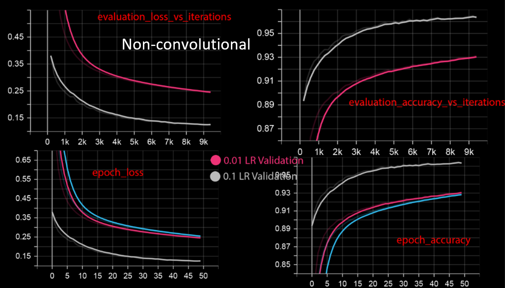
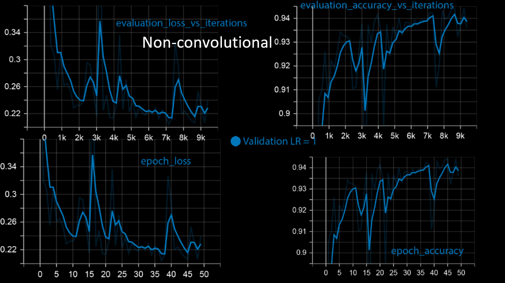
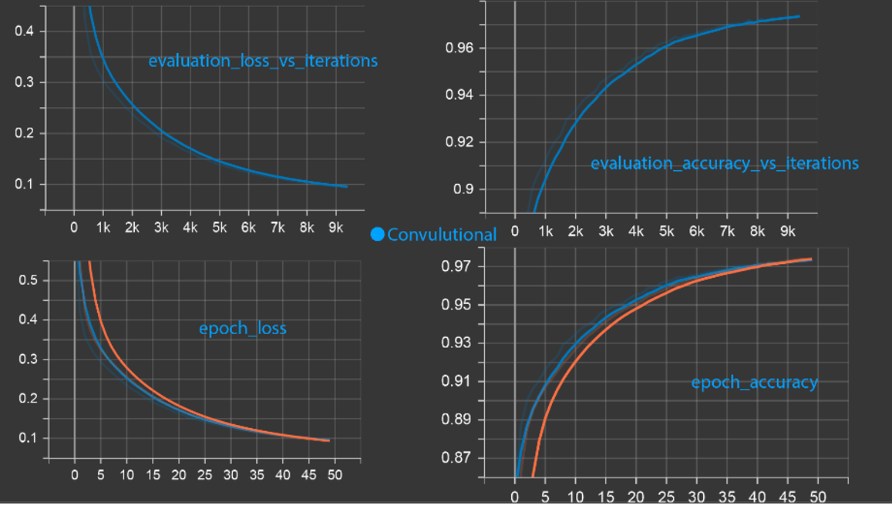
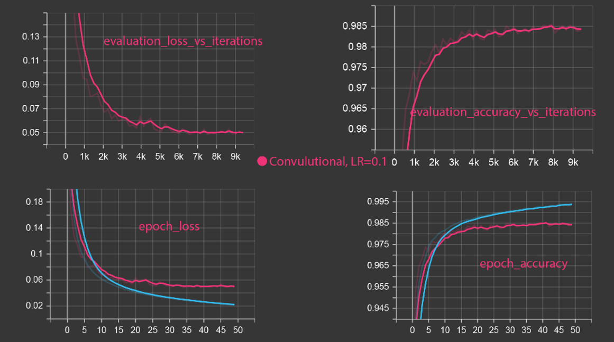
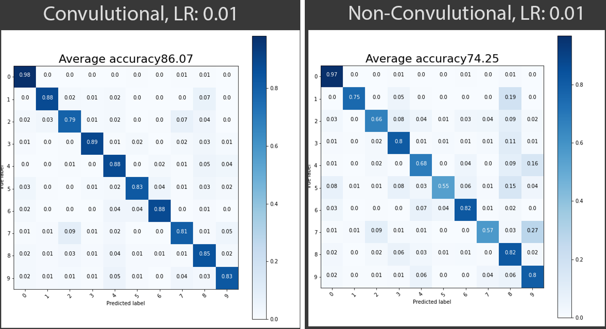

## Fråga 2: Vad händer om vi minskar storleken på våra träningsbatcher (batch_size)? Hur ändras prestandarden och träningstiden.
Om vi minskar storleken på våra tränings-batcher så ökar träningstiden och prestandan blir bättre eftersom den kommer träna på ett färre antal bilder och därav lär den sig just dessa bilder bättre. Däremot har den ju inte fått träna på så många olika bilder vilket gör att den skulle prestera sämre på dessa okända bilder som den ej stött på tidigare.

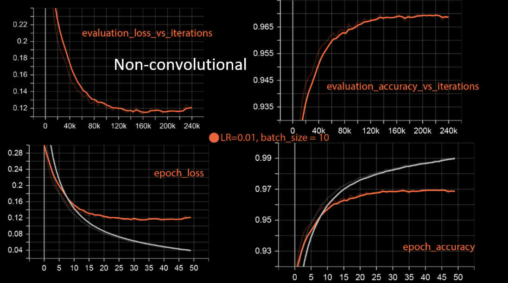
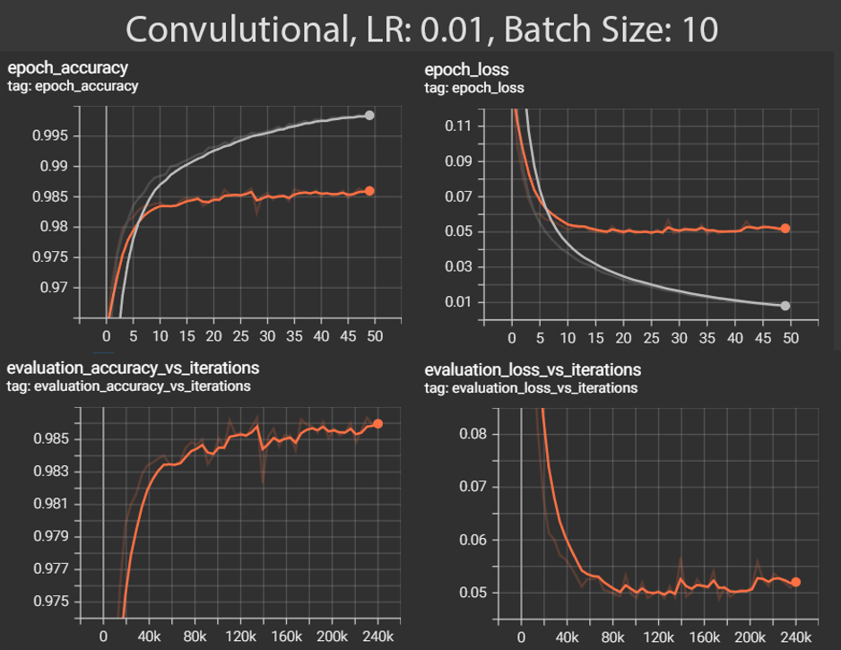

## Fråga 3: Hur skiljer de båda modellerna sig när det kommer till träningstid? Förklara lite kort om varför de skiljer sig åt.
* Convolutional: 13 minuter
* Non-convolutional: 1 minut

Non-convolutional stegar igenom hela bilden pixel för pixel och avgör genom det vad som finns på bilder. Skulle något flyttas eller roteras skulle non-convolutional inte kunna känna igen vad bilden innehåller längre. Convolutional beräknar däremot område för område och tar alltså hänsyn till pixels grannar. Varje gör sin egen gissning på vilken siffra den ser. Sedan vägs alla områdens gissningar samman och utifrån det tar den ett beslut på vilken siffra det är.

## Fråga 4: Hur skiljer sig resultatet mellan de olika testseten och varför kan vi se/inte se en skillnad? Är det samma skillnader för båda närverken?
Det skiljer sig, convolutional presterar bättre men tar längre tid att lära. Non-convolutional presterar avsevärt mycket sämre när den stöter på tecken som den inte stött på tidigare (exempelvis när de roteras). Convolutional däremot presterar bra i dessa scenarion eftersom den inte tittar pixel för pixel utan även tar hänsyn till närliggande pixlar. 

När vi ökar learning rate blir vår AI bättre, detta eftersom den då värdesätter den nya informationen mer gentemot den gamla. Eftersom vi tränar AI på flera olika bilder betyder alltså detta att när vi höjer learning rate så kommer AI ha informationen från flera olika bilder i ”åtanke” när den sedan ska känna igen ett tecken. När vi i stället minskar batch size kommer vår AI att titta på ett färre antal tecken i taget (man kan säga att den zoomar in på det den ska träna på). Detta gör att det tar längre tid att träna eftersom den måste gå igenom fler iterationer för att gå igenom hela sin träningsdata. AI blir även bättre när vi sänkte batch size, detta eftersom den nu tittar på 10 bilder (isället för 256) och sedan tar ett beslut. Därefter tittar den på ytterligare 10 bilder och tar sedan ett beslut. Det innebär alltså att den kommer att kunna titta mer detaljerat på varje ”sample”

## Fråga 5: Vad händer om vi ökar antalet neuroner. Får vi ett bättre eller sämre resultat. Finns det någon undre eller övre gräns för vad som är bäst?

När vi ökar antalet neuroner från 16 till 32 får vi en förbättring (accuracy på 92,8% för 16st och 93,3% för 32st) och ingen större tidsskillnad. Däremot när vi tar steget upp till 1024 neuroner får vi en tydligare förbättring (accuracy på ca 94,4%) men däremot tar det längre tid att träna. Fortsätter vi uppåt till 4096 neuroner så kommer skillnaden i accuracy bli minimal igen gentemot 1024 men tiden blir längre. Minskar vi i stället antalet neuroner från 16 till 8 får vi en tydlig försämring. Detta eftersom det nu inte ens finns ett neuron till varje siffra. Detta mönster blir fortsatt tydligt om vi minskar till 1 neuron. Det finns alltså en undre gräns där försämringen blir sämre och sämre snabbare samt en övre gräns där ökningen i neuroner inte gör någon större värdefull förändring. Den gränsen är kring 10 för den undre samt runt 1024 för den övre

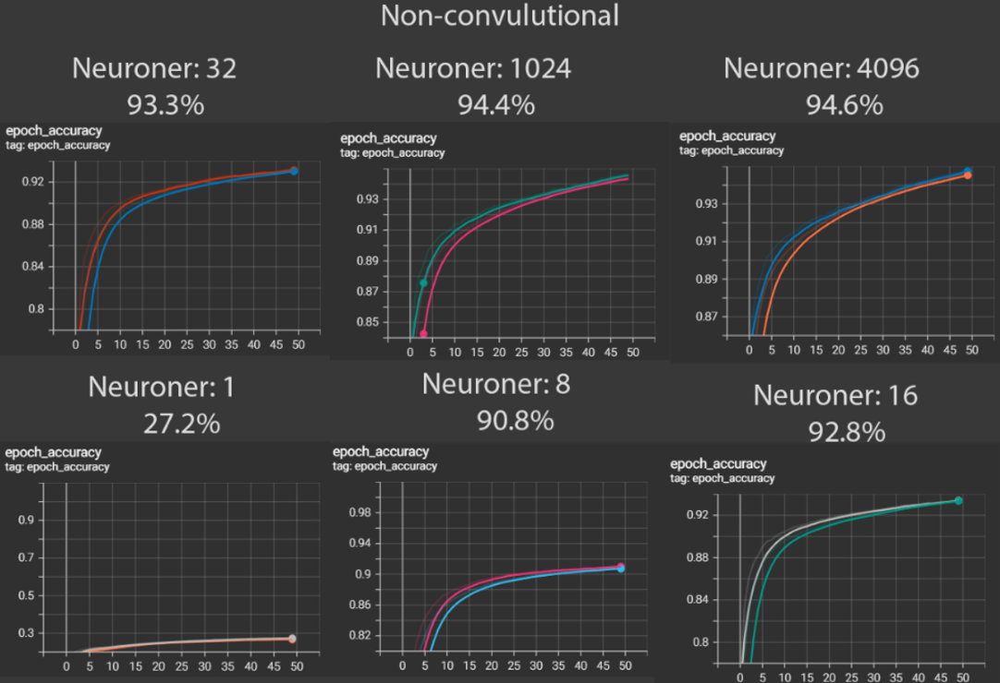

## Fråga 6: Öka området som analyseras åt gången med vårt ”convolutional neural network” (detta görs genom att öka värdet på vår kernel_size) och öka även storleken på stegen mellan varje yta som analyseras ” (detta görs genom att öka värdet på strides). Hur stora värden går det att ha på dessa parametrar innan prestandan börjar att sjunka. Vilka var de bästa värdena som du observerade?

Om vi ökar strides kommer vi göra större hopp mellan testen vilket innebär att vi inte kommer titta lika många gånger på varje pixel. Det resulterar i att AI har mindre data att utgå från. Detta syns tydligt i grafen. När vi ökar kernel size tittar vi på ett större område. Detta ser ut att inte göra den bättre, möjligen snarare ytterst lite sämre. Detsamma gäller om vi minskar kernal size eftersom den förmodligen i stället nu missar delar av datan den borde testat på.

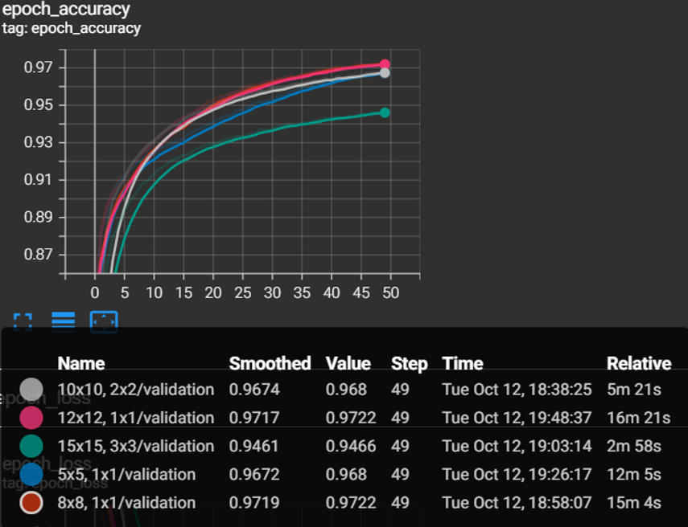

## Fråga 7: Lägg till fler lager och testa om det blir bättre med djupare nätverk. Hur påverkas precisionen och träningstiden?

Inlärningstiden blir mycket längre men precisionen blir mycket bättre mycket fortare

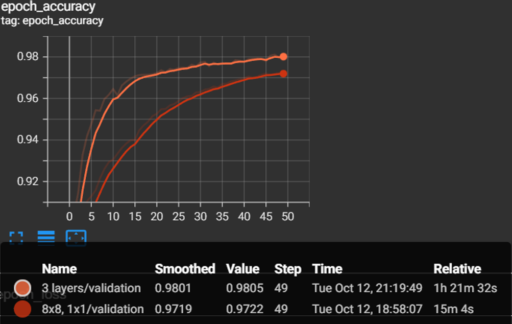

## Fråga 8: 8.	Kör minst 5 st egna experiment med syftet att uppnå så bra precision på de tre olika testdataseten. Som ett sekundärt mål så ska det också gå så snabbt (mätt i sekunder) att träna nätverket. Använd det du har observerat under dina experiment i uppgift 7för att skapa en så bra modell som möjligt. För varje experiment så ska du ge en kort beskrivning av vad det är du testar och varför du valde att testa just den givna parameterinställningen.

#### 1.	4 lager, LR: 0.01, Batch size: 256	(All three kernels are 8x8)
Då ett extra lager i föregående uppgift gav ett bra resultat, tog vi vidare denna kunskap och utvecklade agenten med ännu ett lager för att förvänta sig en högre precision. Testet utfördes:

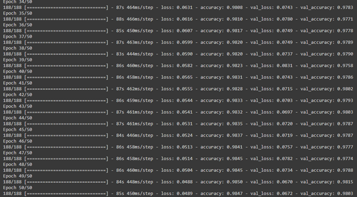

Precisionen var lik uppgiften där tre lager fanns men något bättre. Slutsatsen är att andra variabler kanske behövs ändras för att nå ett bättre resultat med fler lager.

#### 2.	4 lager, LR: 0.1, Batch size: 256	(All three kernels are 8x8)
Eftersom 4 lager neuroner gav ett bra resultat, kom en hypotes till att ”learning rate” kan påverka detta till en högre precision.
Alltså, samma experiment utfördes men en ökning av faktor 10 på ”learning rate”.

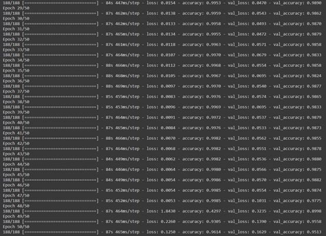

Intressant nog blev precisionen lägre med högre ”learning rate”. Detta kan bero på att agenten blir för ostabil då den överskjuter förändringen på vikterna i neuronerna. Man ser i epok 48 att något märkligt sker då den drastiskt tappar över 50% enheter i precision. Det känns därmed inte lovande att fortsätta med högre "learning-rate". Svårt att avgöra om "learning-rate" är anledningen men vi fortsatte med 0.01 med nästkommande experiment.

#### 3.	4 lager, LR: 0.01, Batch size: 10	(All three kernels are 8x8)
Då en lägre batch size verkar ge ett bättre resultat i tidigare övningar, sker samma förändring nu också jämfört med experiment 2.
Resultatet blev definitivt bättre då det avrundas till 100% träffsäkerhet vid träning men avrundas till 98,9% vid ”validation”. Man kan se på ”loss” att det är en liten faktor så den existerar och Ain är inte perfekt men nästintill. Se info om dom sista epokerna som kördes nedan:

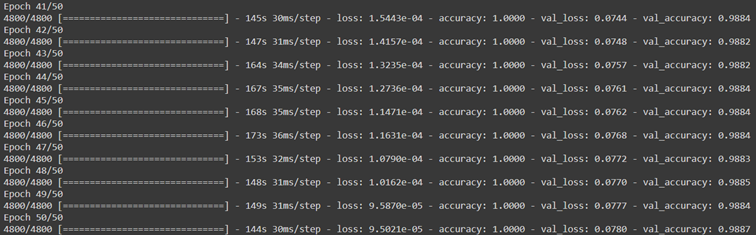

(Tensorboard kraschade och ville inte starta om testet då det tog över 2h)

Resultatet för ”validation” där vi förväntade oss att det skulle hamna. Testet tog ungefär 2.5h. Detta resulterade i en grymt bra agent med hög precision men detta kompenseras med att testet tar lång tid.

#### 4.	4 lager, LR: 0.01, Batch size: 10	(First kernel is 6x6, second kernel is 8x8 and third kernel is 10x10)
Tanken med detta experiment var att nå så låg ”loss-rate” som var möjligt inom relativt rimlig tid.
Eftersom experiment 3 fick bäst resultat hittills, kom hypotesen till att om man gör kernel-size för varje lager olika stora kanske kan agenten hitta sätt att bli mer träffsäker. Utöver det, ska alla parametrar vara dom samma. Resultatet:

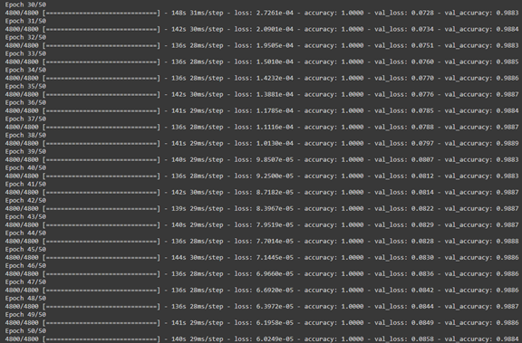

Första intryck var att skillnaden mellan 9.5021e-05 och 6.0249e-05 inte är mycket i värde men samtidigt är det en skillnad på 57%.
Resultatet var alltså som förväntat med att ha nått en agent med en ”loss-rate” som närmar sig 0%. Även fast tidsåtgången för både experiment 3 och 4 var liknande blev agenten 57% bättre. Alltså, kernel-size påverkar enormt vid flera lagers användning.
Detta gäller dock inte för ”validation”. Denna agent når en ”validation-loss” på 0.0858 medan experiment 3 fick en ”validation-loss” på 0.0780. Det verkar alltså som att varierande kernel-size ger bättre resultat i teorin men att samma kernel-size blir bättre i praktiken. Detta kanske betyder att peak-värden ökas men att stabilitet minskar vid varierande kernel-sizes. 

#### 5.	1 lager vs 2 lager
Syftet med detta experiment var att få en så hög ”precisionsvärde” per tid. Föregående exempel fick ett värde på: (98,9% / 150min) = 0,659%/min.
Hypotesen var att om man gör motsvarande motsats jämfört med experiment 1 (minska antalet lager) så kommer man att minska tiden.
Resultatet blev följande:

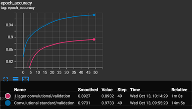

Att nå 89,3% i precision på 1 minut och 8 sekunder ger ett ”precisionsvärde” på: (89,3% / 1.13min) = 79,0%/min.
Resultatet är i detta fall ger ett lägre värde på precisionen vid validering dock en ökning på 1200% gällande effektivitet. Slutsatsen kan dras att en väl fungerande AI med relativt hög träffsäkerhet kan genereras relativt snabbt. Dock ser man på den snabbt avvikande grafen att denna agent inte når mycket högre precision även om den får träna mycket till.

